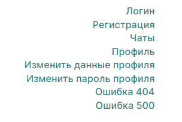

# Проект «Мессенджер»

Проект представляет собой мессенджер для общения между людьми, позволяет создать чаты и отправлять сообщения, а также поддерживает регистрацию пользователей и настройку личного профиля. Специально для данного проект были разработаны оригинальные макеты прототипов в Figma.

## Дизайн
* Ссылка на прототипы страниц в Figma: [Figma](https://www.figma.com/file/me5oYcITEChaxIxB5qp7eb/Messenger?type=design&node-id=0%3A1&mode=design&t=WSzzQVo3A9UDVYMM-1)

## Сборка и запуск проекта

Запустить проект в режиме разработки: `npm run dev`

**Для запуска проекта на localhost**

Установить зависимости проекта: `npm install`
Собрать проект: `npm run build`
Запустить проект на localhost: `npm run start`

*ИЛИ*

Выполнить команду: `npm run start`
(последовательно выполнит перечисленные выше три команды)

## Ссылки

### На приложение

* Опубликованное в Netlify приложение: 

*Навигация по страницам доступнам по кнопкам или же по ссылкам:*

### Спринт 1
*Ссылка на PR*: [#1] ()

